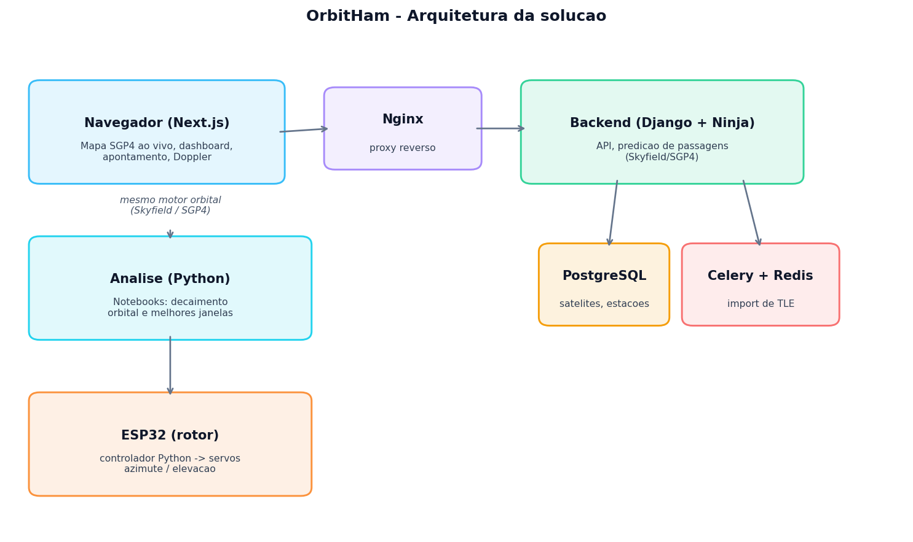

# FIAP - Faculdade de Informática e Administração Paulista

<p align="center">
<a href="https://www.fiap.com.br/"></a>
</p>

<br>

# 🛰️ OrbitHam · Estação Terrena para Rastreamento de Satélites

## Global Solution 2026.1 · Graduação ON em Inteligência Artificial

## 👨‍🎓 Integrantes
- Arthur Prudêncio Soares — RM569295
- Caroline Coelho Mendes — RM570370
- Leandro Paiva — RM572159
- Lucas Viana de Lima — RM571835
- Matheus Tavares Lima — RM572808

---

## 📜 Descrição

O **OrbitHam** é uma plataforma de **estação terrena** que ajuda radioamadores e
entusiastas a acompanharem satélites de órbita baixa (LEO) em tempo real. Ele
responde à pergunta da Global Solution mostrando como a tecnologia espacial
torna processos mais eficientes na Terra: operar uma passagem de satélite exige
saber **quando** ele aparece, **por quanto tempo**, **com que qualidade** e
**para onde apontar a antena**, e o OrbitHam reúne tudo isso em um produto
utilizável, somado a uma camada de **análise de dados** e à **automação de um
rotor de antena com ESP32**.

A solução tem três frentes que compartilham o mesmo motor orbital
(Skyfield/SGP4), mantendo produto, ciência de dados e hardware coerentes:

1. **Aplicação web** (Next.js + Django): mapa ao vivo, predição de passagens,
   dashboard e apontamento de antena com Doppler.
2. **Análise de dados** (Python/Jupyter): previsão de decaimento orbital e
   melhores janelas de operação, com Pandas, Matplotlib/Seaborn e scikit-learn.
3. **Automação** (ESP32): um rotor de antena azimute/elevação comandado pelos
   ângulos calculados pela solução.

## ✨ Funcionalidades

- **Mapa ao vivo**: propagação orbital SGP4 no navegador (satellite.js), com
  trajetória, área de cobertura e ciclo dia/noite, atualizando a cada segundo.
- **Apontamento de antena**: gráfico polar do céu (sky plot), bússola de
  azimute, elevação e **correção Doppler** ao vivo para a sintonia.
- **Passagens**: cálculo de subida/pico/descida e elevação máxima (Skyfield),
  com contagem regressiva e classificação de qualidade por elevação.
- **Estações**: cadastro com geolocalização e preenchimento rápido por capital.
- **Satélites**: importação automática de TLE (CelesTrak, com fallback offline)
  e atualização periódica via Celery.
- **Autenticação**: login/registro com JWT em cookie HttpOnly.
- **Análise de dados**: notebooks de decaimento orbital e melhores janelas.
- **Rotor ESP32**: firmware + controlador Python que apontam a antena.

## 🧰 Stack

**Frontend:** Next.js (App Router), React, TypeScript, Tailwind CSS, MapLibre GL,
satellite.js, TanStack Query, Zustand, Zod.
**Backend:** Python, Django 5, Django Ninja, PostgreSQL 17, Redis, Celery,
Skyfield, SGP4.
**Análise:** Python, Pandas, NumPy, Matplotlib, Seaborn, scikit-learn, Jupyter.
**Hardware:** ESP32 (Arduino/C++), 2 servos, controlador em Python.
**Infra:** Docker Compose, Nginx.

## 🏛️ Arquitetura

Backend em camadas: **API → Service → Repository → Model**. As rotas nunca
acessam o ORM diretamente; entradas e saídas passam sempre por Schemas do Django
Ninja. A propagação orbital roda em Python no backend (Skyfield) e no navegador
(satellite.js), e o mesmo cálculo alimenta a análise de dados e o rotor ESP32.



## 📁 Estrutura de pastas (template FIAP)

```text
1TIAO/Global-Solution-1/
├── src/                      # código-fonte
│   ├── apps/
│   │   ├── frontend/         # Next.js (App Router)
│   │   ├── backend/          # Django + Django Ninja (API em /api)
│   │   ├── analytics/        # análise de dados (notebooks Python)
│   │   └── rotor/            # firmware ESP32 + controlador Python
│   ├── infra/                # Nginx
│   └── docker-compose.yml
├── data/                     # dados (TLEs)
├── docs/                     # documentação (PRD, arquitetura, relatório, etc.)
└── README.md
```

## 🔧 Como executar

Pré-requisitos: **Docker** e **Docker Compose**.

### Aplicação web
```bash
cd 1TIAO/Global-Solution-1/src
docker compose up -d --build
```
Acesse **http://localhost**. A subida do backend roda `migrate` e `seed_demo`
automaticamente.

**Credenciais demo:**
```text
e-mail: demo@orbitham.com
senha:  demo12345
```

### Análise de dados (notebooks)
```bash
cd 1TIAO/Global-Solution-1/src/apps/analytics
python3 -m venv .venv
.venv/bin/python -m pip install -r requirements.txt
.venv/bin/jupyter lab
```
Os notebooks já vêm executados, com gráficos embutidos. Detalhes em
[`src/apps/analytics/README.md`](1TIAO/Global-Solution-1/src/apps/analytics/README.md).

### Rotor de antena (ESP32)
Firmware e controlador Python (funciona com ou sem hardware, modo demo) em
[`src/apps/rotor/README.md`](1TIAO/Global-Solution-1/src/apps/rotor/README.md).

## 🧪 Testes

```bash
cd 1TIAO/Global-Solution-1/src
docker compose exec backend pytest
docker compose exec frontend npx vitest run
```

## 📎 Links e vídeo

- **Vídeo da entrega (até 5 min):** *(adicionar link)*
- **Relatório (PDF):** [`1TIAO/Global-Solution-1/docs/RELATORIO_GS.pdf`](1TIAO/Global-Solution-1/docs/RELATORIO_GS.pdf)

## 📚 Documentação

Em [`1TIAO/Global-Solution-1/docs/`](1TIAO/Global-Solution-1/docs/): PRD,
arquitetura, diretrizes de código, contrato de API, plano de testes e o
relatório da Global Solution.

---

## 📋 Licença

<p xmlns:cc="http://creativecommons.org/ns#" xmlns:dct="http://purl.org/dc/terms/"><a property="dct:title" rel="cc:attributionURL" href="https://github.com/SabrinaOtoni/TEMPLATE-FIAP-GRAD-ON-IA">MODELO GIT FIAP</a> por <a rel="cc:attributionURL dct:creator" property="cc:attributionName" href="https://fiap.com.br">FIAP</a> está licenciado sobre <a href="http://creativecommons.org/licenses/by/4.0/?ref=chooser-v1" target="_blank" rel="license noopener noreferrer" style="display:inline-block;">Attribution 4.0 International</a>.</p>
